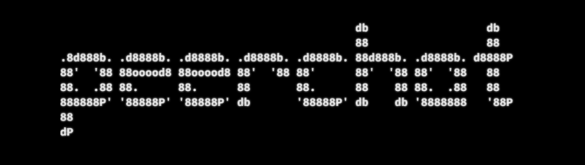

# PeerChat

### A terminal-based P2P chat application using libp2p and Golang that uses a Kademlia DHT and the IPFS network for peer discovery and routing

**Version: 1.1.0**  
**Platform: Windows, Mac OSX and Linux**  
**Language: Go 1.16**   
**License: MIT**

## Overview
The application was inspired by chat examples found on **libp2p**'s pubsub library, but is more evolved and fully featured version of it.   
It uses a *Kademlia DHT* from **libp2p** for peer discovery and routing and supports a more fully featured host. The other components of the **libp2p** such as *TLS* encryption, peer active discovery, *YAMUX* stream multiplexing are integrated as well. 

The application also allows users to jump between different chat rooms without having to restart the application and they can also change their usernames at any point.

The application works for two nodes on the same network or on different networks. Nodes that are behind *NAT*s on private network are able to communicate with each other because the application attempts to configure the router automatically using *UPnP* and also uses *AutoRelay* (TURN) to facilitate the connection between private nodes by discovering relay nodes and connecting to them.

Note: Communcation between nodes on different private networks works only from *v1.1.0*.

## Dependancies
### libp2p
**libp2p** is a modular network stack library born out of The **IPFS Project**.   
**PeerChat**'s P2P and GossipSub layers are built using the Go implementation of **libp2p**.

[**go-libp2p Repository**](https://github.com/libp2p/go-libp2p)  
[**libp2p Documentation**](https://docs.libp2p.io/)  

### tview
**tview** is terminal UI library written in Golang with a collection of rich, interactive widgets.   
**PeerChat**'s UI layer is built using **tview** and **tcell**.

[**tview Repository**](https://github.com/rivo/tview)  
[**tcell Repository**](https://github.com/gdamore/tcell)  

## Installation
The **PeerChat** applcation can be installed in one of two ways.  
1. **Without Go**
    - This method does not require a Go installation on the target system.
    - Download the latest binary/executable for your system platform from the [releases](https://github.com/manishmeganathan/peerchat/releases)
    - Enter the directory where the binary is downlaoded 
    - Run the executable/binary  

    *For Windows*
    ```
    ./peerchat.exe
    ```
    *For Linux*
    ```
    sudo chmod +x peerchat
    ./peerchat
    ```

2. **With Go**
    - This method requires Go v1.16 or greater installed on the target system. [Install Go](https://golang.org/doc/install)
    - This method also uses the ``make`` command, which is built in for Linux and can be installed on Windows using ``choco install make``.
    - Clone the **PeerChat** Repository from [here](https://github.com/manishmeganathan/peerchat) using Git and CD into it.
    ```
    git clone https://github.com/manishmeganathan/peerchat.git 
    cd peerchat
    ```
    - Run the install command on a linux based shell (Git Bash for Windows)
    ```
    make install
    ```
    - The application is now installed and can be invoked anywhere in the system.
    ```
    peerchat
    ```
    - Alternatively, the application can be simply started using
    ```
    go run .
    ```

## Usage
When the **PeerChat** application is invoked without any flags, it joins the *lobby* chat room as a user named *newuser*. This can be modified by passing the ``-user`` and ``-room`` flags.

The following starts the application and joins the *mychatroom* chat room as a user named *manish*.
```
peerchat -user manish -room mychatroom
```

The method of peer discovery method can be modified using the ``-discover`` flag. Valid values are *announce* and *advertise*. The application defaults to the *advertise*. This value should only changed if peer connections aren't being established with the default method.

The loglevel for the application startup runtime can be modified using the ``-log`` flag. Valid values are *trace*, *debug*, *info*, *warn*, *error*, *fatal* and *panic*. The application defaults to *info*. This value is meant for development and debuggin only.


## Future Development
- Support for QUIC and WebSocket transports
- Migrate to Protocol Buffers instead of JSON for message encoding
- Chat Room notification for when user changes names
- Support for other PubSub routers (RandomSub, FloodSub and someday EpiSub)
- Support for password protected Chat Rooms.
